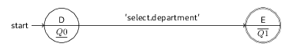

### AUTHOR: XAVIER NOUMBISSI NOUNDOU (yeroth.d at gmail.com).

COMMERCIAL CASE (Computer-Aided Software Engineering) tool
to draw, generate text files.

### MIT SOFTWARE LICENSED

### HOW TO BUILD THIS PROJECT

Run bash script '**build_yr_sd_runtime_verig_lang.sh**'.

### HOW TO GENERATE C++ FILES for 'yr-db-runtime-verif' FROM A SPECIFICATION FILE

[yr-db-runtime-verif: a project for verifying SQL correctness properties of GUI software at runtime](https://github.com/yerothd/yr-db-runtime-verif)

./yr_sd_runtime_verif_lang_comp < yr_sd_runtime_verif.sd_mealy

### HERE is a sample state diagram mealy machine SPECIFICATION

yr_sd_mealy_automaton_spec yr_MISSING_department 
{ 
 &nbsp;&nbsp;START_STATE(D):Q0 
 &nbsp;&nbsp;&nbsp;&nbsp;-> / 'select.department' -> 
 &nbsp;&nbsp;&nbsp;&nbsp;&nbsp;&nbsp;ERROR_STATE(E):Q1. 
}

